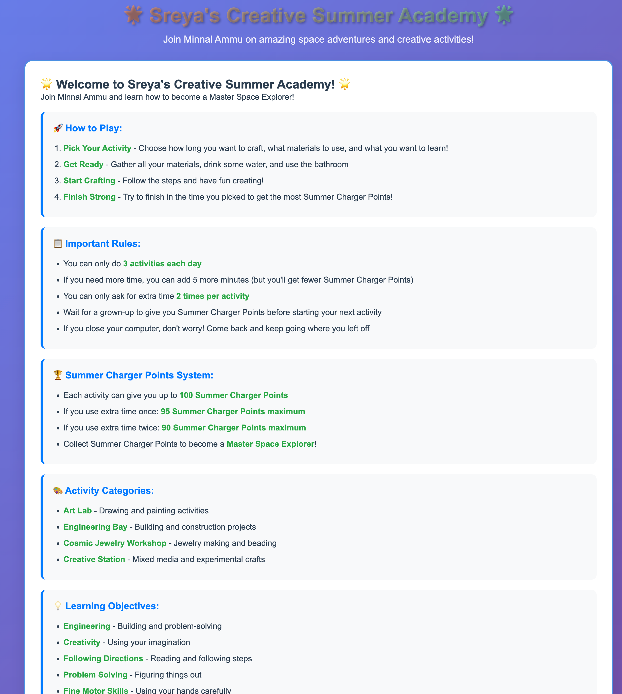
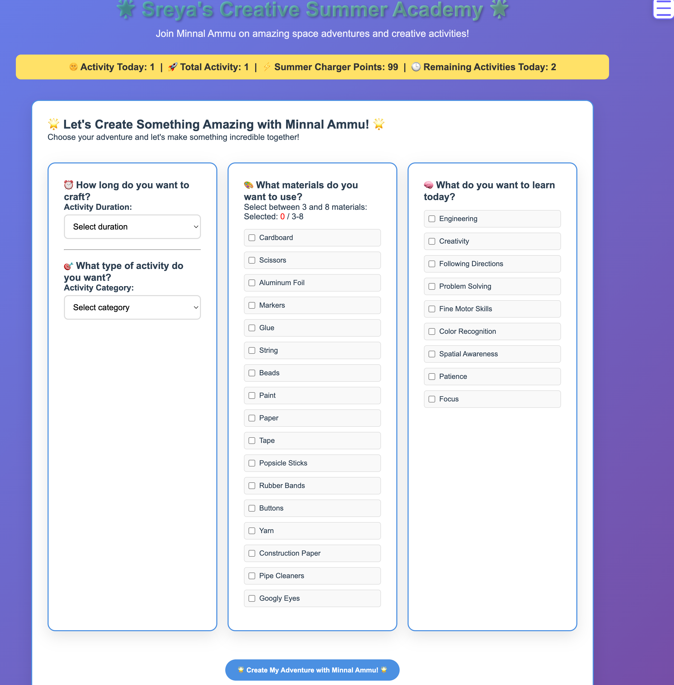
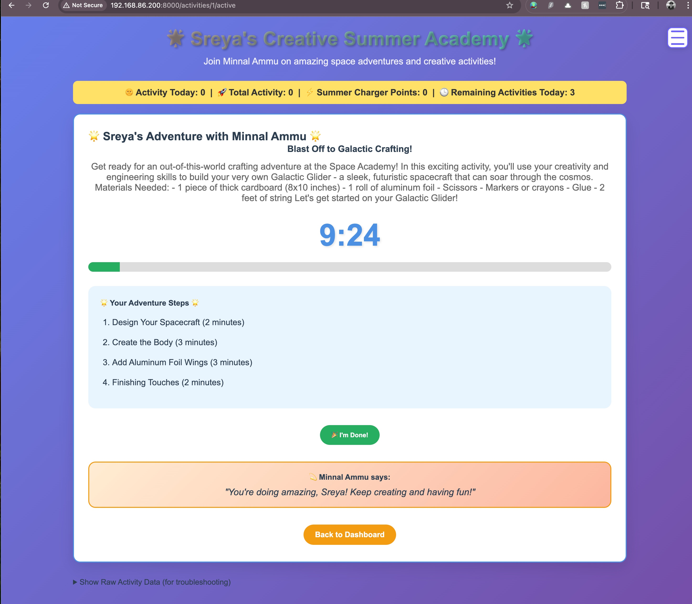
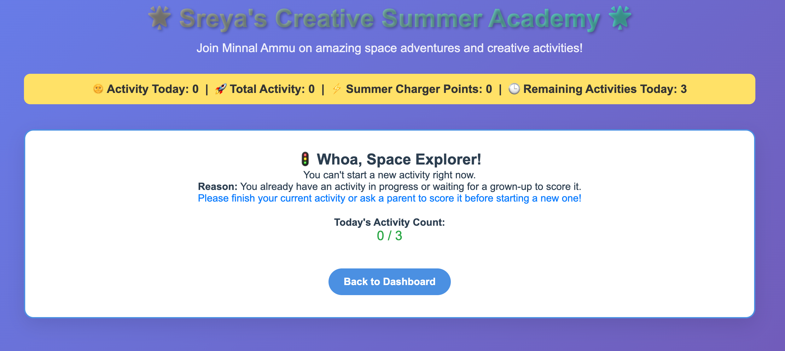
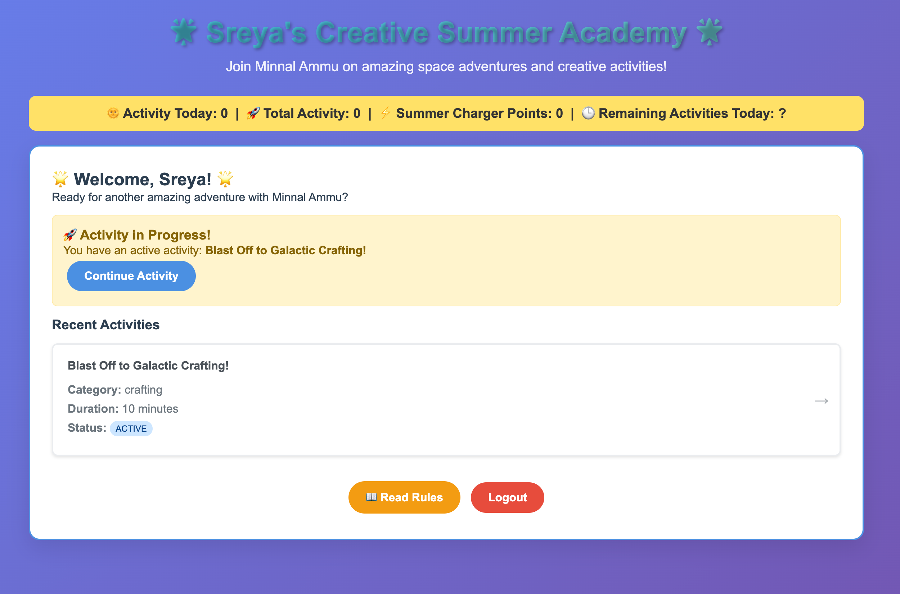
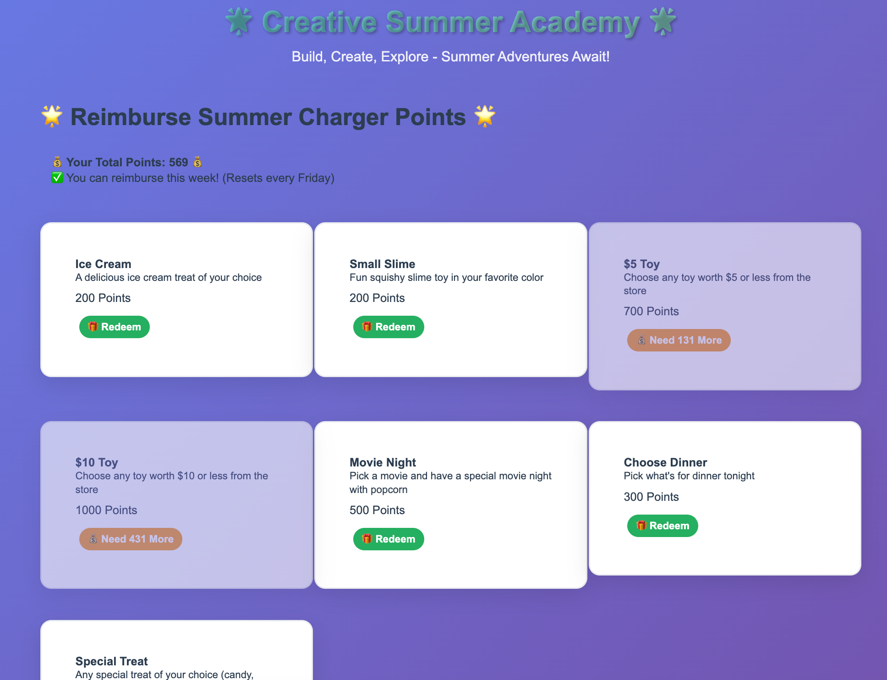
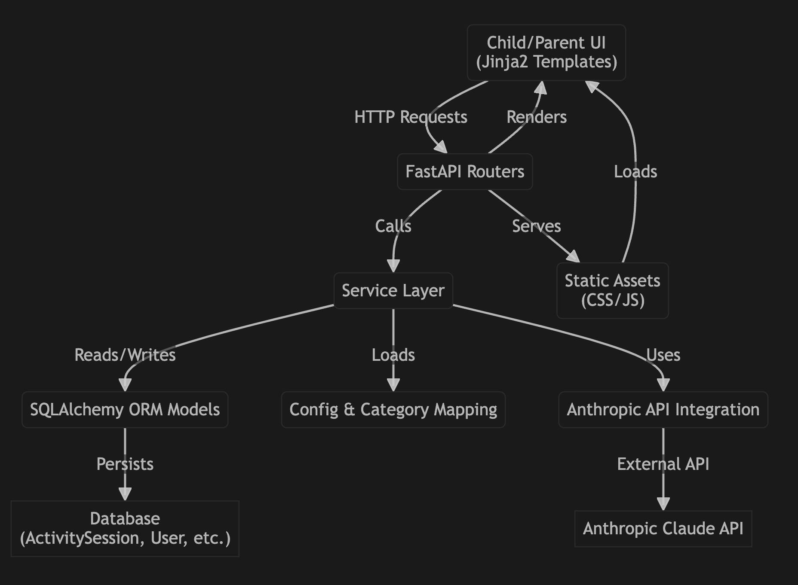

# Creative Summer Academy 🚀

A gamified web application designed to keep kids active and engaged during summer break through AI-generated craft activities. Built with portability in mind to run on various platforms from Raspberry Pi to cloud hosting.

## 🎯 Project Overview

**Target User:** 8-year-old children who enjoy drawing/painting, building things, and making jewelry  
**Purpose:** Encourage creative activities while incorporating reading and learning through gamification  
**Duration:** AI-generated activities based on child's selections (configurable 10-30 minutes with extensions)  
**Innovation:** Uses Anthropic's Claude API to generate personalized craft activities in real-time

## 📸 Demo Screenshots

### Child Experience

#### 1. Rules & How to Play


*The rules page explains how to play, important rules, the points system, activity categories, and learning objectives in a kid-friendly way.*

#### 2. Create Activity Page


*The create activity page for child, child can select the max duration of the acticity, acivity type, regular household items to use in the activity etc to create an activity*

#### 3. Activity Timer & Steps


*The child sees a real-time countdown, step-by-step instructions, and encouragement from Minnal Ammu during an activity.*

#### 4. Activity Limit Reached


*If the child tries to start a new activity before finishing or scoring the current one, a friendly message explains the reason and shows their daily activity count.*

#### 5. Child Dashboard & Recent Activities


*The child dashboard welcomes the user, shows any active activity, and lists recent activities with their status.*

#### 6. Reimburse Summer Charger Points


*Children can redeem their accumulated Summer Charger Points for rewards like toys, treats, and special activities, with a weekly limit.*

### High-level Architecture Diagram

```mermaid
flowchart TD
    subgraph Browser
        UI[Child/Parent UI (Jinja2 Templates)]
        Static[Static Assets (CSS/JS)]
    end

    subgraph FastAPI_Backend
        Routers[FastAPI Routers (activities, auth, admin, etc.)]
        Services[Service Layer (activity_service, scoring_service, etc.)]
        Models[SQLAlchemy ORM Models]
        Config[Config & Category Mapping (config.py, category_materials.json)]
        Anthropic[Anthropic API Integration]
    end

    subgraph Database
        DB[(ActivitySession, User, Parent, DailyStats, etc.)]
    end

    UI -- HTTP Requests --> Routers
    Static -- Loads --> UI
    Routers -- Calls --> Services
    Services -- Reads/Writes --> Models
    Services -- Loads --> Config
    Services -- Uses --> Anthropic
    Models -- Persists --> DB
    Routers -- Renders --> UI
    Routers -- Serves --> Static
    Anthropic -- External API --> Claude[Anthropic Claude API]


## 🎮 Game Concept: "Creative Summer Academy"

Children attend a prestigious space academy where they learn different crafting skills to become Master Space Explorers. The academy features different space stations:

- **Art Lab** - Drawing and painting activities
- **Engineering Bay** - Building and construction projects  
- **Cosmic Jewelry Workshop** - Jewelry making and beading
- **Creative Station** - Mixed media and experimental crafts

### Gamification Elements
- **Points System** - 0-100 points per activity (reduced by 5 for each 5-minute extension)
- **Daily Progress** - Track activities completed and points earned each day
- **Visual Progress** - Academy campus grows and unlocks new areas
- **Ultimate Goal** - Become "Master Space Explorer" with accumulated points

## 🤖 AI Prompt Template System

### Prompt Template Structure
The system uses a single template file (`templates/activity_prompt.ini`) that gets populated with child selections and recent activity history to generate unique, personalized activities.

**Template File: `templates/activity_prompt.ini`**
```ini
[base_prompt]
system_role = You are an expert children activity coordinator at a space-themed summer academy
target_audience = 8-year-old children with developing fine motor skills and creativity
confidence_level = You must have 95% confidence this activity is safe and appropriate

[activity_framework]
create_instruction = Create a fun {selected_category} activity that takes approximately {selected_duration} minutes
materials_instruction = Use at least {min_materials_count} of these available materials: {selected_materials}
learning_focus = The activity should help develop: {selected_objectives}
theme_integration = Incorporate a galactic space academy theme naturally into the activity

[output_structure]
title_requirement = Provide an exciting space-themed title
overview_requirement = Give a brief description of what the child will create and why it is cool
steps_requirement = Break down into clear, numbered steps using simple 8-year-old friendly language
time_guidance = Suggest rough time allocation for each major step
encouragement = Include positive, encouraging language throughout

[safety_and_quality]
safety_check = Ensure all steps are safe for 8-year-olds working with the specified materials
age_appropriateness = Verify fine motor skills required match 8-year-old capabilities
completion_confidence = Child should feel proud and accomplished when finished

[uniqueness_requirement]
avoid_repetition = Do NOT create activities similar to these recent activities: {recent_activities_summary}
ensure_variety = Make this activity distinctly different in approach, final product, and techniques used
```

### Template Variables
The system populates the template with:

**Child Selections:**
- `{selected_duration}` - Activity duration in minutes
- `{selected_materials}` - List of materials child selected
- `{selected_objectives}` - Learning objectives chosen
- `{selected_category}` - Activity category (building, painting, etc.)
- `{min_materials_count}` - Calculated as (selected materials count - 1)

**System Variables:**
- `{recent_activities_summary}` - Summary of last 5 activities to ensure uniqueness

**Example Populated Variables:**
```
{selected_duration} = 25
{selected_materials} = ["cardboard", "aluminum_foil", "markers", "scissors", "glue", "string"]
{min_materials_count} = 5
{selected_objectives} = ["engineering", "creativity"]
{selected_category} = building
{recent_activities_summary} = "1. Space helmet from cardboard, 2. Communication device with foil, 3. Robot friend with boxes, 4. Planet mobile with string, 5. Rocket ship painting"
```

## 🎨 MVP Activity System

### Child Activity Selection Process
1. **Duration Selection** - Choose activity length in 5-minute increments (admin configurable min/max)
2. **Material Selection** - Pick 3-8 materials from available list (admin configurable)
3. **Learning Objectives** - Select from options like "engineering", "creativity", "following_directions"
4. **Category Selection** - Choose from "building", "painting", "crafting", "jewelry making", etc.

### AI-Generated Activity Flow
```
Child Selections → Template Population → Anthropic API Prompt → Generated Activity → Review & Start
```

**API Integration:**
- Uses Anthropic's Claude API to generate activities with 95% confidence
- Activities tailored for 8-year-old development level
- Uses minimum (selected materials - 1) items in generated activity
- Includes last 5 activities to ensure uniqueness and avoid repetition
- 30-second retry with kid-friendly waiting message ("Do 10 jumping jacks while we create your activity!")

### Activity Execution
1. **Pre-Activity Preparation**
   - Show activity description, required materials, total time
   - "Grab all items, drink water, use bathroom" reminder
   - "Ready to Start" button initiates timer

2. **During Activity**
   - Real-time countdown timer
   - Option to extend 5 minutes at a time (maximum 2 extensions)
   - Each extension reduces max possible score by 5 points
   - Session recovery: automatically resume if tab closed/browser refreshed

3. **Activity Completion**
   - Timer completion enables parent scoring
   - Child cannot start new activity until parent provides score
   - "Regenerate activity" option available once per request (then 15-minute cooldown)


### Activity Structure Example
```json
{
  "id": "ai-generated-uuid",
  "title": "Space Station Communication Device",
  "category": "building",
  "selected_duration": 20,
  "actual_duration": 25,
  "extensions_used": 1,
  "max_possible_score": 95,
  "materials_selected": ["cardboard", "aluminum_foil", "markers", "scissors", "glue", "string"],
  "materials_used": ["cardboard", "aluminum_foil", "markers", "scissors", "glue"],
  "learning_objectives": ["engineering", "creativity", "following_directions"],
  "generated_content": {
    "description": "Build a communication device...",
    "steps": [...],
    "safety_notes": [...]
  },
  "child_selections": {...},
  "anthropic_prompt": "...",
  "generation_timestamp": "2025-07-11T10:30:00Z"
}
```

## 👨‍👩‍👧‍👦 Parent/Guardian Controls

### Admin Configuration
```json
{
  "activity_limits": {
    "max_activities_per_day": 3,
    "min_activity_duration": 10,
    "max_activity_duration": 30,
    "duration_increment": 5
  },
  "scoring": {
    "min_score": 0,
    "max_score": 100,
    "extension_penalty": 5
  },
  "materials": {
    "available_items": [
      "cardboard", "scissors", "aluminum_foil", "markers", 
      "glue", "string", "beads", "paint", "paper", "tape"
    ],
    "min_selection": 3,
    "max_selection": 8
  },
  "learning_objectives": [
    "engineering", "creativity", "following_directions",
    "problem_solving", "fine_motor_skills", "color_recognition"
  ],
  "categories": [
    "building", "painting", "crafting", "jewelry_making", "mixed_media"
  ]
}
```

### Parent Scoring System
- **Access Control:** Password-protected (unique per parent)
- **Timing:** Scoring enabled only after planned activity duration completed
- **Information Display:**
  - Activity description and steps
  - Planned time vs actual time spent
  - Number of extensions used
  - Current maximum possible score (100/95/90)
- **Score Range:** 0 to current maximum (reduced by extensions)
- **Tracking:** Parent ID logged with each score entry

### Parent Dashboard Features
- Real-time activity monitoring
- Daily/weekly progress reports
- Configuration management
- Activity history and analytics
- Parent account management

## 🏗️ Technical Architecture

### Technology Stack
- **Backend:** FastAPI (Python) with Anthropic API integration
- **Database:** PostgreSQL (cloud) / SQLite (local development)
- **Frontend:** Jinja2 templates with Bootstrap and JavaScript
- **Package Manager:** uv for fast dependency management
- **Hosting:** Render (primary), designed for easy migration
- **AI Integration:** Anthropic Claude API for activity generation

### Project Structure
```
galactic-summer-academy/
├── app/
│   ├── __init__.py
│   ├── main.py              # FastAPI app entry point
│   ├── config.py            # Environment-based configuration
│   ├── database.py          # Database abstraction layer
│   ├── models/              # Database models
│   │   ├── __init__.py
│   │   ├── user.py          # Child user model
│   │   ├── activity.py      # Activity definitions and sessions
│   │   ├── parent.py        # Parent/guardian model
│   │   ├── scoring.py       # Activity scoring and history
│   │   └── config.py        # System configuration
│   ├── routers/             # API routes
│   │   ├── __init__.py
│   │   ├── auth.py          # Simple authentication
│   │   ├── activities.py    # Activity generation and management
│   │   ├── scoring.py       # Parent scoring interface
│   │   ├── dashboard.py     # Child dashboard and progress
│   │   └── admin.py         # Parent/admin controls
│   ├── services/            # Business logic
│   │   ├── __init__.py
│   │   ├── activity_service.py    # Activity generation logic
│   │   ├── anthropic_service.py   # AI API integration
│   │   ├── template_service.py    # Prompt template management
│   │   ├── scoring_service.py     # Scoring and progress tracking
│   │   ├── session_service.py     # Activity session management
│   │   └── config_service.py      # Configuration management
│   └── templates/           # Jinja2 templates
│       ├── base.html
│       ├── child/
│       │   ├── dashboard.html
│       │   ├── activity_setup.html
│       │   ├── activity_active.html
│       │   ├── activity_complete.html
│       │   └── rules.html
│       ├── parent/
│       │   ├── dashboard.html
│       │   ├── scoring.html
│       │   ├── reports.html
│       │   ├── config.html
│       │   └── rules.html
│       └── shared/
│           ├── rules_child.html
│           └── rules_parent.html
├── static/                  # CSS, JS, images
│   ├── css/
│   ├── js/
│   │   ├── timer.js         # Activity timer management
│   │   ├── session-recovery.js  # Browser session recovery
│   │   └── activity-setup.js    # Activity selection interface
│   └── images/
├── migrations/              # Database migrations
├── scripts/                 # Utility scripts
│   ├── export_data.py       # SQLite to PostgreSQL migration
│   └── import_data.py       # Data import utilities
├── tests/                   # Test files
│   ├── __init__.py
│   ├── test_activities.py
│   ├── test_anthropic.py
│   ├── test_template_service.py
│   ├── test_scoring.py
│   └── test_session_recovery.py
├── pyproject.toml           # uv project configuration
├── requirements.txt         # Dependencies
├── .env.example            # Environment variables template
├── Dockerfile              # For containerization
├── docker-compose.yml      # Local development
└── deploy/                 # Platform-specific configs
    ├── render.yaml
    └── railway.json
```

## 🎯 User Experience Flow

### Child Dashboard
```
Home → [Resume Active Activity] OR [Start New Activity]
       ↓
   Activity Setup (duration, materials, objectives, category)
       ↓
   AI Generation (with retry logic and kid-friendly waiting)
       ↓
   Activity Review → [Regenerate Once] OR [Get Ready]
       ↓
   Preparation Phase → [Start Timer]
       ↓
   Active Activity (with extension options)
       ↓
   Completion → Wait for Parent Scoring
       ↓
   Score Received → Return to Dashboard
```

### Parent Scoring Flow
```
Child Completes Activity → Parent Notification
       ↓
   Parent Password Entry
       ↓
   Scoring Interface (activity details, time info, max score)
       ↓
   Submit Score (0-100, adjusted for extensions)
       ↓
   Child Unlocked for Next Activity
```

## 📊 Database Schema

### Core Tables
```sql
-- Child users
CREATE TABLE users (
    id SERIAL PRIMARY KEY,
    name VARCHAR(100) NOT NULL,
    created_at TIMESTAMP DEFAULT CURRENT_TIMESTAMP
);

-- Parent/guardian accounts
CREATE TABLE parents (
    id SERIAL PRIMARY KEY,
    name VARCHAR(100) NOT NULL,
    password_hash VARCHAR(255) UNIQUE NOT NULL,
    created_at TIMESTAMP DEFAULT CURRENT_TIMESTAMP
);

-- Activity sessions
CREATE TABLE activity_sessions (
    id SERIAL PRIMARY KEY,
    user_id INTEGER REFERENCES users(id),
    status VARCHAR(20) DEFAULT 'active', -- active, completed, scored
    
    -- Child selections
    selected_duration INTEGER NOT NULL,
    selected_materials JSONB NOT NULL,
    selected_objectives JSONB NOT NULL,
    selected_category VARCHAR(50) NOT NULL,
    
    -- Generated content
    anthropic_prompt TEXT,
    generated_activity JSONB NOT NULL,
    generation_timestamp TIMESTAMP,
    
    -- Session tracking
    start_time TIMESTAMP,
    pause_time TIMESTAMP,
    resume_time TIMESTAMP,
    actual_duration INTEGER,
    extensions_used INTEGER DEFAULT 0,
    max_possible_score INTEGER DEFAULT 100,
    
    created_at TIMESTAMP DEFAULT CURRENT_TIMESTAMP,
    updated_at TIMESTAMP DEFAULT CURRENT_TIMESTAMP
);

-- Activity scoring
CREATE TABLE activity_scores (
    id SERIAL PRIMARY KEY,
    session_id INTEGER REFERENCES activity_sessions(id),
    parent_id INTEGER REFERENCES parents(id),
    score INTEGER NOT NULL,
    scored_at TIMESTAMP DEFAULT CURRENT_TIMESTAMP
);

-- System configuration
CREATE TABLE system_config (
    id SERIAL PRIMARY KEY,
    config_key VARCHAR(100) UNIQUE NOT NULL,
    config_value JSONB NOT NULL,
    updated_at TIMESTAMP DEFAULT CURRENT_TIMESTAMP
);

-- Daily activity tracking
CREATE TABLE daily_stats (
    id SERIAL PRIMARY KEY,
    user_id INTEGER REFERENCES users(id),
    date DATE NOT NULL,
    activities_completed INTEGER DEFAULT 0,
    total_points INTEGER DEFAULT 0,
    total_time_minutes INTEGER DEFAULT 0,
    UNIQUE(user_id, date)
);
```

## 🔧 Installation & Setup

### Prerequisites
- Python 3.9+
- Git
- [uv](https://github.com/astral-sh/uv) - Modern Python package manager
- Anthropic API key
- Docker (optional, recommended)

### Local Development Setup (macOS)

#### Install uv (if not already installed)
```bash
# Install uv via curl
curl -LsSf https://astral.sh/uv/install.sh | sh

# Or via Homebrew
brew install uv
```

#### Project Setup
```bash
# Clone repository
git clone https://github.com/yourusername/galactic-summer-academy.git
cd galactic-summer-academy

# Create virtual environment and install dependencies with uv
uv venv
source .venv/bin/activate  # Activate virtual environment

# Install dependencies
uv pip install -r requirements.txt

# Set up environment variables
cp .env.example .env
# Edit .env with your configuration:
# - ANTHROPIC_API_KEY=your_api_key_here
# - DATABASE_URL=sqlite:///./galactic_academy.db
# - SECRET_KEY=your_secret_key

# Initialize database (SQLite for local development)
uv run python -m alembic upgrade head

# Run development server
uv run python -m uvicorn app.main:app --reload --host 0.0.0.0 --port 8000
```

#### Alternative: Using uv run (no manual activation needed)
```bash
# Run commands directly with uv
uv run python -m alembic upgrade head
uv run python -m uvicorn app.main:app --reload --host 0.0.0.0 --port 8000
```

### Local Testing on macOS
```bash
# Access the application
open http://localhost:8000

# Run tests
uv run pytest

# Check code quality
uv run flake8 app/
uv run black --check app/

# Database operations
uv run python -m alembic revision --autogenerate -m "description"
uv run python -m alembic upgrade head
```

### Docker Setup
```bash
# Build and run with docker-compose
docker-compose up --build

# Application will be available at http://localhost:8000
```

## 🚀 Deployment Strategy

### Development Workflow
1. **Local Development** - Build and test MVP on macOS using SQLite
2. **Local Testing** - Complete functional testing of all core features
3. **Cloud Deployment** - Deploy to Render only after successful local MVP

### Local Environment (macOS)
- **Database:** SQLite (file-based, no server required)
- **Package Manager:** uv for fast dependency management
- **Testing:** Full feature testing before cloud deployment
- **Benefits:** Fast iteration, no internet dependency, cost-free development

### Cloud Deployment (Render)
- **Database:** PostgreSQL (automatic provisioning)
- **Deployment:** GitHub integration, automatic deploys
- **Migration:** Seamless transition from SQLite to PostgreSQL
- **Cost:** Free tier (750 hours/month)

### Environment Variables
```bash
# .env.example
ANTHROPIC_API_KEY=your_anthropic_api_key
DATABASE_URL=sqlite:///./galactic_academy.db  # Local
# DATABASE_URL=postgresql://... # Production
SECRET_KEY=your_secret_key_for_sessions
ENVIRONMENT=development
DEBUG=True

# Anthropic API Configuration
ANTHROPIC_MODEL=claude-3-haiku-20240307
ANTHROPIC_MAX_TOKENS=1500
ANTHROPIC_TEMPERATURE=0.7

# Application Configuration
MAX_ACTIVITIES_PER_DAY=3
MIN_ACTIVITY_DURATION=10
MAX_ACTIVITY_DURATION=30
```

## 📋 Rules Page Content

### Rules for Kids (Simple Language)

**🌟 Welcome to Creative Summer Academy! 🌟**

**How to Play:**
1. **Pick Your Activity** - Choose how long you want to craft, what materials to use, and what you want to learn!
2. **Get Ready** - Gather all your materials, drink some water, and use the bathroom
3. **Start Crafting** - Follow the steps and have fun creating!
4. **Finish Strong** - Try to finish in the time you picked to get the most points!

**Important Rules:**
- You can only do **3 activities each day**
- If you need more time, you can add 5 more minutes (but you'll get fewer points)
- You can only ask for extra time **2 times per activity**
- Wait for a grown-up to give you points before starting your next activity
- If you close your computer, don't worry! Come back and keep going where you left off

**Points:**
- Each activity can give you up to **100 points**
- If you use extra time once: **95 points maximum**
- If you use extra time twice: **90 points maximum**
- Collect points to become a **Master Space Explorer**!

### Rules for Parents/Guardians

**🎯 Creative Summer Academy Parent Guide**

**Scoring System:**
- Activities are scored 0-100 points based on effort, creativity, and completion
- Maximum score reduces by 5 points for each 5-minute extension used
- Scoring is only available after the child's selected duration is completed
- Each parent requires a unique password for scoring access

**Daily Limits:**
- Configurable maximum activities per day (default: 3)
- Configurable activity duration range (default: 10-30 minutes)
- 15-minute cooldown after using "regenerate activity" option

**Child Safety & Engagement:**
- All activities are AI-generated specifically for 8-year-old development level
- Activities use only pre-approved materials from your configuration
- Built-in preparation reminders (gather materials, hydration, bathroom)
- Session recovery ensures no lost progress from technical issues

**Administrative Controls:**
- Configure available materials, learning objectives, and categories
- Set daily limits and time restrictions
- View comprehensive activity reports and progress tracking
- Manage multiple parent accounts with unique access

**Activity Generation:**
- Uses Anthropic's Claude AI for personalized, age-appropriate activities
- 30-second retry system with kid-friendly waiting messages
- One regeneration attempt per activity request to prevent endless cycling

## 🎯 Features Roadmap

### Phase 1 (MVP - Local Development First)
- [ ] Child activity selection interface (duration, materials, objectives, category)
- [ ] Anthropic API integration for activity generation
- [ ] Real-time activity timer with extension capability
- [ ] Parent scoring system with password protection
- [ ] Session recovery and progress tracking
- [ ] Basic admin configuration interface
- [ ] Rules pages for children and parents

### Phase 2 (Enhanced)
- [ ] Advanced progress visualization and academy campus
- [ ] Seasonal activity themes and special challenges
- [ ] Photo submission for completed activities
- [ ] Enhanced reporting and analytics dashboard
- [ ] Multi-child support for families
- [ ] Activity difficulty progression system

### Phase 3 (Advanced)
- [ ] Community activity sharing (moderated)
- [ ] Integration with educational standards
- [ ] Voice instructions and accessibility features
- [ ] Offline activity mode with sync
- [ ] Advanced AI personalization based on preferences
- [ ] Parent-child collaboration activities

---

**Built with ❤️ for creative kids and their families**